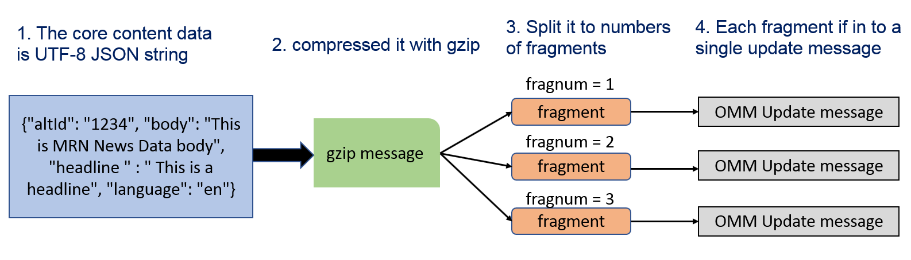

# Machine Readable News Example with LSEG Data Library for Python

- Last update: April 2025
- Compiler: Python
- Prerequisite: The Real-Time Distribution System or The Real-Time -- Optimized credentials (V1) with MRN service

This example shows how developers may use the [LSEG Data Library for Python](https://developers.lseg.com/en/api-catalog/lseg-data-platform/lseg-data-library-for-python) Delivery layer feature to subscribe to the Machine Readable News (MRN) from LSEG Real-Time Distribution System (RTDS) and LSEG Real-Time Optimized (RTO). The example just connects to LSEG Real-Time platform via a WebSocket connection, then subscribes and displays MRN News data in a console. 

**Note:** The news message is in UTF-8 JSON string format. Some news messages that contain special Unicode character may not be able to show in Windows OS console (cmd, git bash, powershell, etc) due to the OS limitation. Those messages will be print as ```UnicodeEncodeError exception. Cannot decode Unicode character``` message in a console instead.

## <a id="prerequisite"></a> Prerequisite

This example requires the following dependencies.

1. The Real-Time Distribution System (RTDS) or Real-Time Optimized (RTO) with MRN Service.
2. [Python](https://www.python.org/) interpreter and runtime.
3. RTO Access credentials (Version 1 or Version 2) for the RTO example.
4. Internet connection.

Please contact your LSEG representative to help you to access the RTO account and services.

## <a id="rdp_lib"></a>Introduction to the Data Library for Python

The [Data Library for Python](https://developers.lseg.com/en/api-catalog/lseg-data-platform/lseg-data-library-for-python) provides a set of ease-of-use interfaces offering coders uniform access to the breadth and depth of financial data and services available on the Workspace, RDP, and Real-Time Platforms. The API is designed to provide consistent access through multiple access channels and target both Professional Developers and Financial Coders. Developers can choose to access content from the desktop, through their deployed streaming services, or directly to the cloud. With the Data Library, the same Python code can be used to retrieve data regardless of which access point you choose to connect to the platform.

 

The Data Library are available in the following programming languages:

- [Python](https://developers.lseg.com/en/api-catalog/lseg-data-platform/lseg-data-library-for-python)
- [.NET](https://developers.lseg.com/en/api-catalog/lseg-data-platform/lseg-data-library-for-net)
- [TypeScript](https://developers.lseg.com/en/api-catalog/refinitiv-data-platform/refinitiv-data-library-for-typescript)

For more deep detail regarding the Data Library for Python, please refer to the following articles and tutorials:

- [Quickstart](https://developers.lseg.com/en/api-catalog/lseg-data-platform/lseg-data-library-for-python/quick-start).
- [Documentation](https://developers.lseg.com/en/api-catalog/lseg-data-platform/lseg-data-library-for-python/documentation).
- [Tutorials](https://developers.lseg.com/en/api-catalog/lseg-data-platform/lseg-data-library-for-python/tutorials).
- [GitHub](https://github.com/LSEG-API-Samples/Example.DataLibrary.Python).

### Disclaimer

This project is based on Data Library Python versions **2.1.1**.

## <a id="news_mrn_overview"></a>Machine Readable News Overview

Machine Readable News (MRN) is an advanced service for automating the consumption and systematic analysis of news. It delivers deep historical news archives, ultra-low latency structured news and news analytics directly to your applications. This enables algorithms to exploit the power of news to seize opportunities, capitalize on market inefficiencies, and manage event risk.

### <a id="mrn_data_model"></a>MRN Data model

MRN is published over the Real-Time platform using an Open Message Model (OMM) envelope in News Text Analytics domain messages. The Real-time News content set is made available over MRN_STORY RIC. The content data is contained in a FRAGMENT field that has been compressed and potentially fragmented across multiple messages, to reduce bandwidth and message size.

A FRAGMENT field has a different data type based on a connection type:

- RSSL connection (RTSDK [C++](https://developers.lseg.com/en/api-catalog/refinitiv-real-time-opnsrc/rt-sdk-cc)/[Java](https://developers.lseg.com/en/api-catalog/refinitiv-real-time-opnsrc/rt-sdk-java)/[C#](https://developers.lseg.com/en/api-catalog/refinitiv-real-time-opnsrc/rt-sdk-cc)): BUFFER type
- WebSocket connection: Base64 ASCII string

The data goes through the following series of transformations:

1. The core content data is a UTF-8 JSON string
2. This JSON string is compressed using gzip
3. The compressed JSON is split into several fragments (BUFFER or Base64 ASCII string) which each fit into a single update message
4. The data fragments are added to an update message as the FRAGMENT field value in a FieldList envelope



Therefore, to parse the core content data, the application will need to reverse this process. The WebSocket application also needs to convert a received Base64 string in a FRAGMENT field to bytes data before further process this field. This application uses Python [base64](https://docs.python.org/3/library/base64.html) and [zlib](https://docs.python.org/3/library/zlib.html) modules to decode Base64 string and decompress JSON string.

If you are not familiar with MRN concept, please visit the following resources which will give you a full explanation of the MRN data model and implementation logic:

- [Webinar Recording: Introduction to Machine Readable News](https://developers.lseg.com/news#news-accordion-nid-12045)
- [Introduction to Machine Readable News (MRN) with Enterprise Message API (EMA)](https://developers.lseg.com/en/article-catalog/article/introduction-machine-readable-news-mrn-elektron-message-api-ema).
- [MRN Data Models and the Real-Time SDK Implementation Guide](https://developers.lseg.com/en/api-catalog/refinitiv-real-time-opnsrc/rt-sdk-java/documentation#mrn-data-models-implementation-guide).
- [Introduction to Machine Readable News with WebSocket API](https://developers.lseg.com/en/article-catalog/article/introduction-machine-readable-news-elektron-websocket-api-refinitiv).


## <a id="how_to_run"></a>How to run this example

The first step is to unzip or download the example project folder into a directory of your choice. 

It is an advisable to create a dedicate Python environment to run each Python project. You can create a new [Python virtual environment](https://docs.python.org/3/library/venv.html) to run this example with the following steps:

1. Open the ```src/lseg_data.config.json``` file and add your RTO or RTDS information based on your preference

    ```json
    "sessions": {
        "default": "platform.ldp",
        "platform": {
            "ldp": {
                "app-key": "YOUR APP KEY GOES HERE!",
                "username": "YOUR LDP LOGIN OR MACHINE GOES HERE!",
                "password": "YOUR LDP PASSWORD GOES HERE!",
                "signon_control":true
            },
            "ldpv2":{
                "client_id": "Service-ID (Client ID V2)",
                "client_secret": "Client Secret",
                "signon_control":true
            },
            "deployed": {
                "app-key": "YOUR APP KEY GOES HERE!",
                "realtime-distribution-system": {
                    "url" : "YOUR DEPLOYED HOST:PORT GOES HERE!",
                    "dacs" : {
                        "username" : "YOUR DACS ID GOES HERE!",
                        "application-id" : 256,
                        "position" : ""
                    }
                }
            }
        }
    }
    ```
2. Please note that the ```platform``` configuration is based on your connection information:
    
    - if you are using the RTO with the *Version 1 Authentication*, the ```default``` value must be ```platform.ldp```.
    - if you are using the RTO with the *Version 2 Authentication*, the ```default``` value must be ```platform.ldpv2```.
    - if you are using the *local RTDS connection*, the ```default``` value must be ```platform.deployed```.

3. Open a command prompt application and go to the project folder
4. Run the following command in a command prompt to create a new Python virtual environment named *venv* for the project (the name can be changed based on your preference).

    ```bash
    $ python -m venv venv
    ```
5. Once the environment creation is succeed, activate a virtual environment with the following command.

    ```bash
    #Windows
    $ venv\Scripts\activate

    #Linux
    $ source venv/bin/activate

    #success
    (venv)$
    ```
6. Run the following command to install the dependencies in virtual environment.

    ```bash
    (venv)$ pip install -r requirements.txt
    ```

7. To run an application go to the ```src``` folder while the ```venv``` environment is activated, and run the following command

    ```bash
    (venv)$src> python OMMStream-MRN-LD.py
    ```

8. Press ```Ctrl+C``` buttons to stop the application, and run the following command to deactivate the Python virtual environment.

    ```bash
    (venv)$src> deactivate

    $src>
    ```

### How to run this a Notebook example

The project contain both console console application *src/OMMStream-MRN-LD.py* and Jupyter Notebook *src/OMMStream-MRN-LD.ipynb*. In order to run the Notebook example, please follows the steps below.

1. Open the ```src/lseg_data.config.json``` file and add your RTO or RTDS information based on your preference like the suggestion on above section.
2. Open a command prompt application and go to the project folder
3. Run the following command in a command prompt to create a new Python virtual environment named *notebook* for the project (the name can be changed based on your preference).

    ```bash
    $ python -m venv notebook
    ```
4. Once the environment creation is succeed, activate a virtual environment with the following command.

    ```bash
    #Windows
    $ notebook\Scripts\activate

    #Linux
    $ source notebook/bin/activate

    #success
    (notebook)$
    ```
5. Run the following command to install the Notebook dependencies in virtual environment.

    ```bash
    (notebook)$ pip install -r requirements-notebook.txt
    ```

6. To run a Notebook application run the ```jupyter lab``` command while the ```notebook``` environment is activated, and open the *src/OMMStream-MRN-LD.ipynb* file.

    ```bash
    (notebook)$ jupyter lab
    ```

### Note about the Virtual Environment 

If you are using the [Anaconda](https://anaconda.org/anaconda/conda)/[Miniconda](https://docs.anaconda.com/miniconda/) Python distribution, please refer to the [Conda document](https://docs.conda.io/projects/conda/en/latest/user-guide/getting-started.html) about how to create a virtual environment using Conda.

## <a id="how_to_run_docker"></a>Bonus: How to run this example with Docker

1. Setup the ```src/lseg_data.config.json``` file based on your preference like the instructions above
2. Go to the project folder in the console
3. Run the following command in a console to build an image from a Dockerfile.

    ```bash
    $> docker build -t mrn_python .
    ```

4. Once the build is a success, you can create and run the container with the following command

    ```bash
    $> docker run --name mrn_python -it mrn_python mrn_python
    ```

5. Press Ctrl+C buttons to stop the application

## Example Results

### MRN Data Refresh Message

```json
>>> Refresh event received at 14:04:40.076276
{
  "ID": 5,
  "Type": "Refresh",
  "Domain": "NewsTextAnalytics",
  "Key": {
    "Service": "ELEKTRON_DD",
    "Name": "MRN_STORY"
  },
  "State": {
    "Stream": "Open",
    "Data": "Ok"
  },
  "Qos": {
    "Timeliness": "Realtime",
    "Rate": "JitConflated"
  },
  "PermData": "AwEBEAAc",
  "SeqNumber": 26414,
  "Fields": {
    "PROD_PERM": 10001,
    "ACTIV_DATE": "2025-01-04",
    "RECORDTYPE": 30,
    "RDN_EXCHD2": "MRN",
    "TIMACT_MS": 65276147,
    "GUID": null,
    "CONTEXT_ID": 3752,
    "DDS_DSO_ID": 4232,
    "SPS_SP_RIC": ".[SPSML2L1",
    "MRN_V_MAJ": "2",
    "MRN_TYPE": "STORY",
    "MDU_V_MIN": null,
    "MDU_DATE": null,
    "MRN_V_MIN": "10",
    "MRN_SRC": "HK1_PRD_A",
    "MDUTM_NS": null,
    "FRAG_NUM": 1,
    "TOT_SIZE": 0,
    "FRAGMENT": null
  }
}
```

### MRN Data Update Message

```json
>>> Update event received at 14:05:40.076276
{
  "ID": 5,
  "Type": "Update",
  "Domain": "NewsTextAnalytics",
  "UpdateType": "Unspecified",
  "DoNotConflate": true,
  "DoNotRipple": true,
  "DoNotCache": true,
  "Key": {
    "Service": "ELEKTRON_DD",
    "Name": "MRN_STORY"
  },
  "PermData": "AwEBEBU8",
  "SeqNumber": 54958,
  "Fields": {
    "TIMACT_MS": 26035856,
    "ACTIV_DATE": "2025-01-06",
    "MRN_TYPE": "STORY",
    "MRN_V_MAJ": "2",
    "MRN_V_MIN": "10",
    "TOT_SIZE": 716,
    "FRAG_NUM": 1,
    "GUID": "Pt3BVKYG__2501062wgGRnlW/ulmGvzHnd35kqZ6qc0/chruUU4ph2",
    "MRN_SRC": "HK1_PRD_A",
    "FRAGMENT": "H4sIAAAAAAAC/8VUUW/TMBB+51ec8gRS0ybp2iG/tdlWCmsa2oxpY2hyE6cxuHbmOB0B8d85J+0mISbxxov93dm++8732T8dKsw8c4gjYzOcfvpwM3N6Dq0zzmTKKod8dqKYxNML9HYgjJwvPWejsgYPeeP3VAajAXiBP4TJAs7XycA7RTxbJHfSdY+YQCyoMRVM4kkIU64wQcUExEVT8ZQKAknBXlqEUiskUwGvIKcpF9xQwzIwhVb1tsCZAbvmMlOP8DouaMVgPn8DhqWFVEJtmz6EqpaG6ZJq00CqWcaNjaZKJiFXGqgQkKpdSSWmxoDUANUMpDJgz/CUl9RwuQUu23RHRhnXLDWieeJy4NGHeQ6NqtsoVb3ZcdMeR5fGGJhyh/GUfDpHJVhSlorMoKD7LjkVmtGssZjnHGs+XKPKcR9W8peyNKuM5qmNXvWgFMzeB/Ld84zBo0YiWHMXL+04YLF2lwElGRSWYak5MjGqrbUyGN5mtMZiGT6342USORfoqkAy2ycFG+yQpBuBFgbeYYdtNX04Jf6QjEb98TA4SuZQIcogr1EEE8G0cd07iQrMua5MiDeC3Uf1BV4wcj3f9caJdwx0OgpucWeBtya4ZLgrvpwkyZqA77qY7r/pEElxS/r4zO7vg5Hne+PgcTtbSXE9qMVutv/xTmbD0beH2/FD6g3SQtdXVydlEdjTEhthH+Uyx2eJb1BQua3p1tbI7O3skBqaSVOiK0Cb7w6GY9h3MygF5XbfQQsa/dGaxJfJ2jrrzRqrqfHJO5jHkLqy7cIVVO9X1Hj7F0zICXoWxP941s5BmOB8Rd62Y9iOi3aMcFzZ/8LzPP8ZP8Ew8v6wrBEFZDJbzTs0nS8vOhSeJTcHtFx04PI86kC0mnVgFV3bn8nQb2zNHmr7fznE7zm13iLG32rYc/aoSVT8P0jo16vf3flwkBsFAAA="
  }
}
FRAGMENT length = 716
decompress News FRAGMENT(s) for GUID Pt3BVKYG__2501062wgGRnlW/ulmGvzHnd35kqZ6qc0/chruUU4ph2
News = {'altId': 'nPt3BVKYG', 'audiences': ['NP:PBF', 'NP:PBFCN'], 'body': '06Jan25/ 0213 AM EST/0713 GMT\n--0713 GMT: Platts APAC Biodiesel Physical: The APAC Biodiesel Physical process is facilitated through the eWindow (Phase II) technology. Counterparty credit is open for all companies that are not participating in the process directly through eWindow. If you are submitting your information through an editor and have not already notified Platts of any counterparty credit restrictions, please provide written notification at least one hour prior to the start of the MOC process if any counterparty credit filters need to be enabled or modified. 7:13:55.632 GMT\n--Platts Biofuel Alert--\n', 'firstCreated': '2025-01-06T07:13:55.752Z', 'headline': 'PLATTS: 1-- 7: Platts APAC Biodiesel Physical: The APAC Biodiesel Physical process is facilitated through the eWindow (Phase II) techno', 'id': 'Pt3BVKYG__2501062wgGRnlW/ulmGvzHnd35kqZ6qc0/chruUU4ph2', 'instancesOf': [], 'language': 'en', 'messageType': 2, 'mimeType': 'text/plain', 'provider': 'NS:PLTS', 'pubStatus': 'stat:usable', 'subjects': ['A:4', 'M:1QD', 'M:2CT', 'U:8', 'U:C', 'U:M', 'U:N', 'R:PBF0001', 'R:PBF001', 'R:PBFCN0001', 'R:PBFCN001', 'N2:AGRI', 'N2:BIOF', 'N2:CDTY', 'N2:COM', 'N2:LEN', 'N2:NRG', 'N2:RNW'], 'takeSequence': 1, 'urgency': 3, 'versionCreated': '2025-01-06T07:13:55.752Z'}
```

## <a id="references"></a>References

For further details, please check out the following resources:

- [LSEG Data Library for Python](https://developers.lseg.com/en/api-catalog/lseg-data-platform/lseg-data-library-for-python)
- [Introduction to Machine Readable News with WebSocket API](https://developers.lseg.com/en/article-catalog/article/introduction-machine-readable-news-elektron-websocket-api-refinitiv).
- [WebSocket API Machine Readable News Example with Python](https://github.com/LSEG-API-Samples/Example.WebSocketAPI.Python.MRN) on GitHub.
- [Machine Readable News (MRN) & N2_UBMS Comparison and Migration Guide](https://developers.lseg.com/en/article-catalog/article/machine-readable-news-mrn-n2_ubms-comparison-and-migration-guide).
- [MRN WebSocket JavaScript example on GitHub](https://github.com/LSEG-API-Samples/Example.WebSocketAPI.Javascript.NewsMonitor).
- [MRN WebSocket C# NewsViewer example on GitHub](https://github.com/LSEG-API-Samples/Example.WebSocketAPI.CSharp.MRNWebSocketViewer).
- [Developer Article: Introduction to Machine Readable News with WebSocket API](https://developers.lseg.com/en/article-catalog/article/introduction-machine-readable-news-elektron-websocket-api-refinitiv).
- [Account authorization V1 to V2 migration cheat sheet](https://developers.lseg.com/en/article-catalog/article/account-authorization-v1-to-v2-migration-cheat-sheet) article.
- [Getting Started with Version 2 Authentication for Real-Time - Optimized: Overview](https://developers.lseg.com/en/article-catalog/article/getting-started-with-version-2-authentication-for-refinitiv-real) article.


For any questions related to this example or the LSEG Data Library, please use the Developer Community [Q&A Forum](https://community.developers.refinitiv.com/).